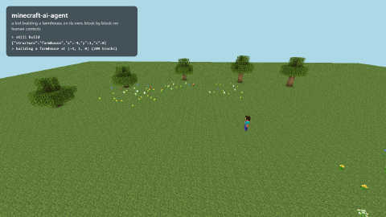

# minecraft-ai-agent

[](https://github.com/ViniciuscLemos/minecraft-ai-agent/actions/workflows/ci.yml)



*The bot building a farmhouse by itself: 209 blocks in about 90 seconds, sped up. Recorded with `npm run demo`.*

An AI agent that plays Minecraft with you on your own server. The goal: you type something like
*"get some wood, make tools and build a small house next to me"* and it plans the steps and does them.

It's being built in stages. Right now the bot follows you, obeys chat commands and has tested skills:
it chops trees, crafts (tables, tools, glass panes...), mines, smelts in a furnace it makes itself and
builds houses from blueprints (the farmhouse above: foundation, log frame, windows, a stair roof,
a chimney, torches and furniture). The AI part (Claude planning and replanning) comes on top of that.

## Why I built it

I've played Minecraft since it came out on the Xbox 360, and most of my childhood was spent watching
other people play it on YouTube. Now I study Computer Engineering, and this project is where those two
things meet: the game I grew up with and the stuff I actually want to work with.

It's also a hard problem, which is the fun part. A language model can write a nice plan, but Minecraft is
full of boring ways to fail: falling into a hole, running out of tools, getting attacked at night,
getting stuck on a fence. So the design keeps the AI away from the fiddly parts.

## How it's put together

| Layer | What it does | Who decides |
| --- | --- | --- |
| Reflexes | safe pathfinding, eating, armor, fight or flee, nighttime, getting unstuck | plain code, always on |
| Skills | collect wood, mine, craft, build... each one checks what it needs first and fails with a clear reason | plain code, tested |
| Planner | turns your request into a list of skills and replans when one fails | Claude (tool use) |

The AI never moves the bot block by block. It only picks skills, and the skills are tested on a real
server, so a bad plan fails safely instead of walking the bot into lava.

## Roadmap

- [x] **Stage 1:** local server setup, bot that follows you and obeys chat commands, scenario tests on a real server
- [x] **Stage 2:** skills (wood, crafting, mining, smelting, building) and reflexes (eating, getting unstuck, deaths), each tested on a real server
- [ ] **Stage 3/4:** Claude plans and replans from plain text requests
- [ ] **Stage 5:** web panel with a 3D view of what the bot sees and its reasoning log
- [ ] **Stage 6:** demo video

## Running it

You need Node 24 and Java 21.

```bash
npm install
npm run server:setup      # downloads the official 1.21.1 server from Mojang and makes a flat test world
npm run server            # starts it (localhost only, offline mode)
npm run bot               # in another terminal
```

`server:setup` doesn't accept the [Minecraft EULA](https://aka.ms/MinecraftEULA) for you. Read it, and if
you agree, run `npm run server:setup -- --accept-eula`.

Then open Minecraft 1.21.1, join `localhost` and type in the chat:

| Command | What it does |
| --- | --- |
| `!follow` | follows you around |
| `!come` | walks to where you are |
| `!goto <x> <z>` or `!goto <x> <y> <z>` | walks to a place |
| `!stop` | stops what it's doing |
| `!where` | says where it is |
| `!inventory` | lists what it carries |
| `!wood <n>` | chops trees for n logs |
| `!craft <item> [n]` | crafts something, making the table, planks and sticks it needs on the way |
| `!mine <block> [n]` | mines blocks it can see, and says which tool is missing if it can't |
| `!build <farmhouse\|cottage\|house\|hut>` | builds next to it, and lists the missing materials if it can't |

Settings like the bot name and who can give it orders go in `.env` (see `.env.example`).

## Tests

```bash
npm test                  # unit tests, instant
npm run test:scenario     # starts a real server in a fresh world and checks the bot in the game
```

The scenario tests join a test player, give the bot orders in the chat and check what happens in the
world: where it ends up, what's in its inventory, which blocks it placed. They run in CI too, on every push.

## Demo video

```bash
npm run demo              # the bot builds the farmhouse while a camera circles around it
```

It runs a server in a throwaway world, opens a 3D view of it ([prismarine-viewer](https://github.com/PrismarineJS/prismarine-viewer))
in Edge with Playwright and records it, plus a timelapse GIF made from screenshots.

## Things I ran into

- **Java 17 vs 21.** Minecraft 1.21 needs Java 21, and my `JAVA_HOME` pointed to 17 for other projects.
  The start script now checks the version of every Java it finds instead of trusting the first one.
- **A crafting table that came out as a button.** mineflayer's `bot.craft()` takes the result before the server
  has seen every ingredient in the grid, and on 1.21 asking for a crafting table once gave back an oak button
  (what a single plank makes). The bot now places the ingredients itself and waits for the server to show the
  right result before taking it.
- **Logs that never reached the inventory.** The four logs of a trunk drop together right under the rest of the
  tree, where the bot doesn't fit, so it picks items up from a block away instead of walking onto them.
- **Stairs that were never drawn.** The 3D viewer skips every block whose name contains "air", to leave out
  `air` and `cave_air`... and `oak_stairs` has "air" in it. The roof was invisible until the viewer server
  started serving a copy of its worker with that check fixed.
- **A dandelion in the way.** Flowers have no hitbox, but the server won't place a block over them, so the bot
  breaks plants before placing.
- **An accent in the user folder.** On Windows, Java opens a Unix socket in the temp folder when it starts
  the network code. With a path like `C:\Users\Usuário` that fails with `Invalid argument: connect` and the
  server crashes. The fix is to point that socket to a folder without accents.

## License

MIT
